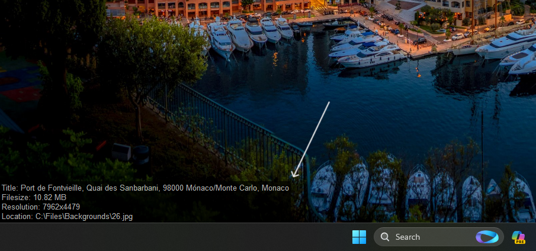
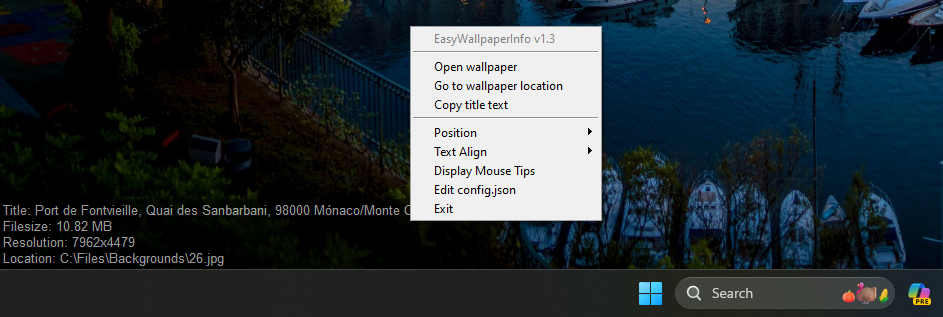

# EasyWallpaperInfo: Wallpaper Info Widget / One Click Next Wallpaper / Find Desktop Background Path
EasyWallpaperInfo is a handy Python app that lets you explore your desktop wallpaper. With a simple and customizable widget, you can see your current wallpaper’s metadata title, filesize, resolution, and location on your screen. You can also cycle to the next wallpaper with a click, or open the wallpaper in file explorer or your default image viewer. EasyWallpaperInfo is a great tool for wallpaper enthusiasts who want to know more about their desktop backgrounds.



> # [Download the Latest Executable (.exe) Release](https://github.com/denizsafak/EasyWallpaperInfo/releases/latest)
> You can download the executable (.exe) version of the same script, making it easy to use without the need to install Python or other libraries.

## `Features`
- Display wallpaper details on the screen.
- Go to next desktop wallpaper with a single click.
- Context menu for quick actions (open wallpaper, go to location, copy title).
- Customizable appearance (font size, text color, background color).
- Options to show/hide title, size, resolution, and location.
- Mouse tips for user guidance.
- Prevents multiple instances from running simultaneously.



## `Configuration`
Open the config.json file to customize settings:

- `"bottom_margin":` Distance from the bottom of the screen.
- `min_width:` Minimum width of the display window.
- `alpha:` Transparency level of the display window.
- `indicator_update_frequency:` Update frequency of wallpaper details.
- `text_size`, `text_font`, `text_color`, `background_color`: Appearance settings.
- `show_title`, `show_size`, `show_resolution`, `show_location`: Toggle display of information.
- `display_mouse_tips:` Display initial mouse tips.

## `How to Run?`

### Option 1: Executable Script
- If you don't want to install Python and dependencies, you can download the precompiled executable version from the Releases section.
[Download the Latest Executable (.exe) Release](https://github.com/denizsafak/EasyWallpaperInfo/releases/latest)
- Double-click on EasyWallpaperInfo.exe to launch the application. The wallpaper information display will appear on your screen.

### Option 2: Run with Python
- Clone or download the repository to your local machine.
- Install the required Python packages and Python itself.
- Open a terminal in the project directory and type:
```bash
python EasyWallpaperInfo.pyw
```
- The wallpaper information display will appear on your screen.

## `Useage`
- Left Click (Next Wallpaper): Click on the display to cycle to the next wallpaper.
- Right Click (Menu): Right-click on the display to open a context menu with options to open the wallpaper, go to its location, copy the title text, and exit the application.
- To exit the application, right click on the window and select "Exit."


> [!NOTE]
> - This script is primarily intended for Windows. Adaptations might be needed for other operating systems.

> Tags: easywallpaperinfo, current wallpaper information, wallpaper details, background details, background information, next desktop wallpaper, desktop wallpaper details, desktop wallpaper info, python wallpaper script, wallpaper location finder, easy wallpaper management, wallpaper utilities, wallpaper changer, wallpaper viewer, background image details, wallpaper tools, wallpaper filesize, wallpaper accessibility, windows desktop
